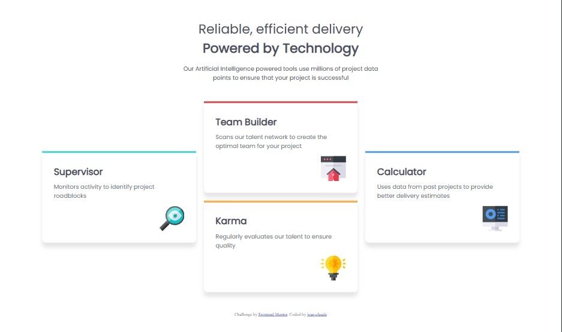

# Frontend Mentor - Four card feature section solution

This is a solution to the [Four card feature section challenge on Frontend Mentor](https://www.frontendmentor.io/challenges/four-card-feature-section-weK1eFYK). Frontend Mentor challenges help you improve your coding skills by building realistic projects.

## Table of contents

- [The challenge](#the-challenge)
- [Screenshot](#screenshot)
- [Built with](#built-with)
- [What I learned](#what-i-learned)
- [Continued development](#continued-development)
- [Useful resources](#useful-resources)
- [Author](#author)

### The challenge

Users should be able to:

- View the optimal layout for the site depending on their device's screen size

### Screenshot



### Built with

- Semantic HTML5 markup
- CSS custom properties
- Flexbox
- CSS Grid
- Mobile-first workflow
- [Clamp-calculator](https://www.marcbacon.com/tools/clamp-calculator) - for the font
- [Google-font](https://fonts.google.com/) - for the fonts

### What I learned

To see how you can add code snippets, see below:

```css
@font-face {
  font-family: "Poppins";
  src: url(design/fonts/Poppins/Poppins-Regular.ttf) format("truetype");
}
```

```css
:root {
  /* Color Variables */
  --Cyan: hsl(180, 62%, 55%);
  --red: hsl(0, 78%, 62%);
  --Orange: hsl(34, 97%, 64%);
  --Blue: hsl(212, 86%, 64%);
  --White: hsl(0, 0%, 100%);
  --Grey400: hsl(212, 6%, 44%);
  --Grey500: hsl(234, 12%, 34%);
}
```

```css
.icon {
  display: block;
  margin: 15px 0 0 auto;
}
```

### Continued development

I'm planning to learn more about css variables and responsiveness

### Useful resources

- [Clamp-calculator](https://www.marcbacon.com/tools/clamp-calculator) - this helped me a lot for respnsive text using clamp method

## Author

- Frontend Mentor - [@Jeanclaude09-dev](https://www.frontendmentor.io/profile/Jeanclaude09-dev)
- instagram - [@iamje_nclaude](https://www.instagram.com/iamje_nclaude)
- github - [@jeanclaude09-dev](https://github.com/Jeanclaude09-dev)
